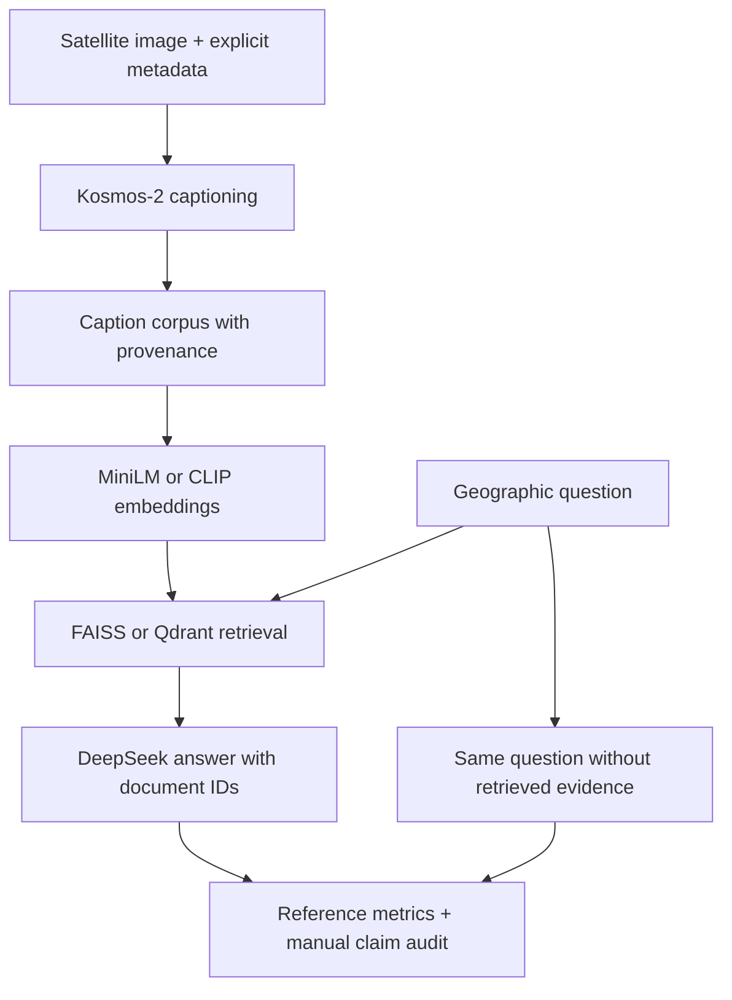

# GeoRAG-VLM

**Satellite image captioning, semantic retrieval, and controlled RAG experiments.**

This project grew out of Ved's remote-sensing independent study: generating descriptions with Kosmos-2, experimenting with structured metadata prompts, embedding captions with CLIP and MiniLM, retrieving with FAISS and Qdrant, and using DeepSeek to answer geographic questions.

The current release organizes those experiments into reusable Python modules and reproducible local examples. It is a research prototype. **It does not establish that RAG improves factual accuracy or reduces hallucination.**

## Run an example in under a minute

From the repository root, with Python 3.10 or newer:

```bash
cd GeoRAG-VLM
python -m venv .venv
# macOS/Linux:
source .venv/bin/activate
# Windows PowerShell: .venv\Scripts\Activate.ps1
python -m pip install -e .
georag demo --top-k 3
georag retrieve "urban area with a river" --corpus data/sample/legacy_captions.jsonl
python -m unittest discover -s tests -v
```

The demo uses a **TF-IDF lexical retriever and six synthetic descriptions**. It needs no GPU, API credentials, imagery, or model downloads. Its retrieval metrics verify the workflow on toy fixtures; they measure neither satellite interpretation nor LLM quality. Preserved legacy captions are generated text and are explicitly unverified.

## Architecture



The RAG answer stage is **text-only**: DeepSeek receives captions, not image pixels. Optional CLIP image indexing supports text-to-image retrieval when original images are available. Spatial/time reranking is a separate helper; it is not automatically enabled by the CLI.

## What's implemented

| Component | Current behavior |
|---|---|
| Kosmos-2 | Image-only, metadata, and legacy-tag prompt modes; raw output and entities retained |
| Metadata | Explicit scene schema; conservative filename date/index hints; no guessed coordinates |
| Text retrieval | Offline TF-IDF, MiniLM embeddings, or CLIP text embeddings |
| Image retrieval | Optional CLIP image vectors, queried by CLIP text vectors |
| Vector stores | FAISS cosine search and Qdrant; local in-memory mode by default |
| Geographic reranking | Haversine distance and acquisition-date proximity over retrieved candidates |
| RAG comparison | Same question, target, system instructions, model and settings in both conditions |
| Evaluation | Recall@K, truncated reciprocal rank, ROUGE-L F1, optional smoothed BLEU-4 |
| Claim audit | Manual supported / unsupported / unverifiable labels; no automatic truth oracle |
| Tracking | SQLite run records, corpus/query fingerprints, prompts, retrieved IDs, model settings |

RemoteCLIP, SatCLIP, Clay, a large scene benchmark, and temporal change detection are **future work**, not implemented features.

## Neural retrieval

```bash
python -m pip install -r requirements.txt
georag retrieve "urban area with a river" \
  --corpus data/sample/legacy_captions.jsonl --backend faiss --encoder minilm
georag retrieve "vegetation" \
  --corpus data/sample/legacy_captions.jsonl --backend qdrant --encoder clip
```

Model weights download on first use. For CLIP image retrieval, give every corpus record an `image_path`, provide the imagery, and use `--encoder clip --representation image --image-root /path/to/images`. CLIP text is truncated to 77 tokens, which may discard details in long captions. Neural vector adapters rebuild their index per command.

For optional Qdrant Cloud use, set `QDRANT_URL` and `QDRANT_API_KEY`. Each invocation creates a uniquely named collection; it never deletes existing collections. Cloud collections persist after exit and should be managed in your own dashboard.

## Caption your own scenes

No original satellite pixels were included in the four notebook uploads. Follow [data/README.md](data/README.md) and fill a manifest with authoritative acquisition metadata.

```bash
georag caption --manifest data/private/scenes.jsonl --mode image_only
georag caption --manifest data/private/scenes.jsonl --mode metadata \
  --output results/runs/captions_metadata.jsonl
```

Use the same images and questions for the prompt ablation. Model inference can require substantial RAM/VRAM. The code prefers CUDA when available and otherwise uses CPU. RGB conversion does not calculate spectral indices: provide correctly produced RGB or index renderings and their legends. The program never assumes that bright colors mean high index values.

## Paired RAG evaluation

Prepare a separate corpus and human-reviewed query/reference file. The example schema is in `data/sample/evaluation_queries.example.jsonl`; its placeholder reference must be replaced. Keep reference answers out of indexed evidence. Use `exclude_ids` to exclude target scenes where the protocol requires it; split by location/event so near-duplicate scenes cannot leak across evaluation and retrieval sets.

Set a **new** `DEEPSEEK_API_KEY` in your shell (see `.env.example`). The program does not automatically load `.env` files.

```bash
georag compare --corpus data/private/corpus.jsonl \
  --queries data/private/queries.jsonl --backend faiss --encoder minilm --bleu
```

This explicitly makes two paid API requests per query. Results are checkpointed after each completed pair and logged to SQLite. API request order alternates across queries; temperature is 0 in both conditions. Hosted responses may still vary, and the provider's model alias can change. Request prompts, reported model, usage, corpus fingerprint, and retrieval scores are recorded. A failed partial pair is not recorded as a completed comparison.

These comparisons test adding text evidence to a text-answer model. They do not, by themselves, compare image-only VLM reasoning with a multimodal RAG model. Text-overlap metrics reward wording overlap and cannot establish geographic correctness. Human scene references and independent claim annotation are required for factual/hallucination findings.

## Original experiment and provenance

The original comparison notebook saved BLEU values of **0.1791 (RAG)** and **0.0222 (no RAG)**. Those are historical observations only: the conditions used different questions, the corpus had two documents with `top_k=2`, and the `ground_truth` variable is missing from saved source. This release does not advertise an 8× accuracy improvement.

The original CLIP notebook computed image and caption vectors but inserted only caption vectors into FAISS. Custom `<context>` and `<object>` tags were prompting experiments, not trained metadata interfaces. Claimed individual vehicles/people and population details in generated captions need verification against actual image resolution and external records.

- [Notebook provenance and migration](docs/provenance.md)
- [Evaluation protocol](docs/evaluation.md)
- [Research roadmap](docs/roadmap.md)
- [Source archives](notebooks/archive/) — sanitized historical source, not supported Run All notebooks
- [Recorded historical result](results/legacy_observation.json)
- [Offline fixture result](results/toy_retrieval.json)

## Repository layout

| Directory | Purpose |
|---|---|
| `src/georag/` | Maintained caption, embedding, retrieval, RAG, metric and tracking modules |
| `notebooks/` | Four maintained walkthroughs with costly calls opt-in |
| `notebooks/archive/` | Four sanitized originals with cleared outputs and disabled collection resets |
| `data/sample/` | Synthetic fixtures, unverified legacy captions, manifest/query examples |
| `docs/` | Provenance, limits, evaluation and roadmap |
| `tests/` | Offline behavior tests using fixtures and mocked API responses |
| `results/` | Historical observation and actual local fixture result |

## Credential cleanup and validation limits

Hard-coded credentials and the original cloud endpoint have been removed from the published sources; outputs and notebook metadata were cleared. **Revoke/rotate the old DeepSeek and Qdrant keys in their dashboards.** Removing source text does not revoke a key or modify your original uploaded copies.

Offline tests, walkthroughs, syntax validation, and credential scans are run before publication. Full Kosmos-2/CLIP/MiniLM inference and authenticated DeepSeek/Qdrant Cloud calls were not run in the preparation environment: it lacks the original imagery, downloaded model weights, and replacement credentials. Dependency ranges are declared; there is no verified model-environment lockfile yet.

## References

- [Kosmos-2 model and inference documentation](https://huggingface.co/docs/transformers/en/model_doc/kosmos-2)
- [Qdrant Python client](https://github.com/qdrant/qdrant-client)
- [DeepSeek API guide](https://api-docs.deepseek.com/guides/multi_round_chat/)
- [RemoteCLIP](https://github.com/ChenDelong1999/RemoteCLIP) — prospective retrieval comparison

Original notebook authorship and project history are preserved in the provenance document. No license has been assigned to third-party imagery or independently authored contributions.
