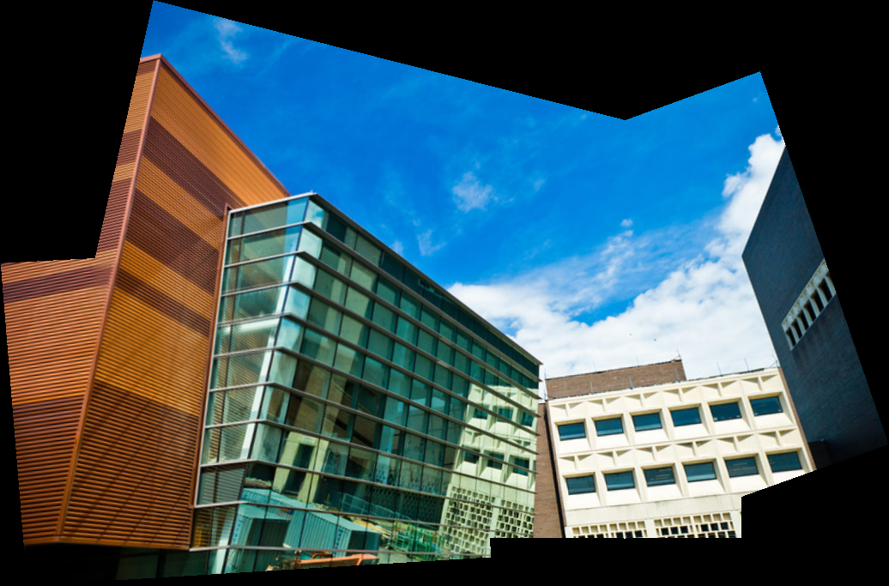
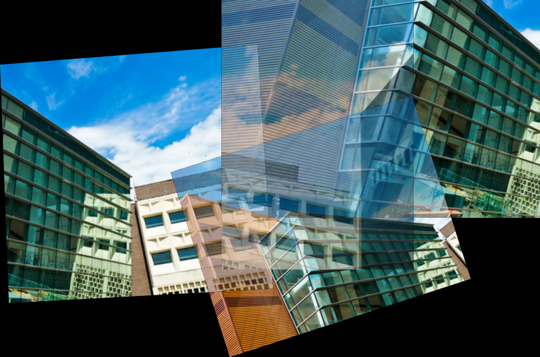
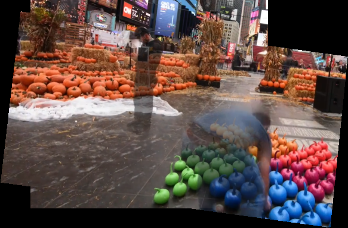

# Feature-Based Image Stitching

**RootSIFT matching, RANSAC homographies, and graph-based panorama construction with PyTorch and Kornia.**

This project started as Ved's University at Buffalo CSE 473/573 Computer Vision Project 2 (Fall 2025). The original implementation estimated feature correspondences and projective transforms, warped images to a shared canvas, and combined their pixels. This portfolio version preserves that submission and adds corrected geometry, explicit support masks, connected-image traversal, feather blending, and behavior tests.

The maintained version is a portfolio refactor, not a claim that these fixes were in the original coursework submission.

## Visual results

### Corrected four-image panorama



Generated by the maintained implementation on the four supplied images using CPU PyTorch 2.5.1, Kornia 0.7.0, seed 17 and four threads. Alignment is substantially more coherent than the original example; this is a visual observation, not a measured accuracy gain. Some seam/parallax artifacts remain.

### Original submitted panorama



This is the actual saved submission output, not a newly generated result. Misalignment and ghosting are visible. [the provenance notes](docs/provenance.md) distinguish original and refactored artifacts.

### Two-image mosaic



The geometry is aligned, but moving foreground remains visible. This project does not claim successful dynamic-object removal.

## Run it

Python 3.10–3.12 is recommended. From the repository root:

```bash
cd Image-Stitching
python prepare_assets.py
python -m venv .venv
# macOS/Linux:
source .venv/bin/activate
# Windows PowerShell: .venv\Scripts\Activate.ps1
python -m pip install torch==2.5.1 --index-url https://download.pytorch.org/whl/cpu
python -m pip install -r requirements.txt
python task1.py --input_path examples/task1 --output_path results/runs/task1.png
python task2.py --input_path examples/task2 --output_path results/runs/task2.png \
  --json results/runs/task2_overlap.json
python -m unittest discover -s tests -v
```

`--output` is supported as an alias for `--output_path`. The CLI seeds PyTorch with 17 and defaults to four CPU threads. RANSAC results can vary across versions/devices; a seed does not guarantee identical geometry everywhere. No neural checkpoints or remote services are used.

GitHub’s binary-upload operation was unavailable during publishing. Exact PNG bytes are bundled as base64 under `assets/`; `prepare_assets.py` verifies SHA-256 and restores all ten PNGs using only the standard library. It refuses to overwrite modified images. README previews are SVG containers embedding the same PNG pixels; no image content is altered. If a GitHub client does not render embedded SVG previews, clone and decode the PNGs to inspect them locally.

The example inputs were extracted from the uploaded submission ZIP. Two inputs are supplied for Task 1 and four for Task 2. Original source, helper scripts, README and fractional overlap JSON are preserved in `archive/`; the course's BSD 3-Clause license is retained in `LICENSE`.

## Pipeline

1. Validate RGB tensors and normalize uint8 pixels to [0,1].
2. Extract up to 800 RootSIFT features per image with Kornia.
3. Match descriptors using symmetric mutual nearest-neighbor ratio testing (`smnn`, threshold 0.8).
4. Estimate each image-B-to-image-A homography with RANSAC. Require at least eight inliers, an inlier ratio of at least 0.20, a numerically valid transform, and at least 20% projected overlap of the smaller support.
5. Build a graph of accepted image pairs. Select its largest connected component and compose transforms through intermediate images.
6. Project all image corners, translate negative coordinates, and allocate a canvas including the final pixel row/column.
7. Warp RGB pixels and explicit support masks independently; feather overlapping image contributions and clamp the result to RGB uint8.
8. Return the image and, for the panorama, a symmetric binary overlap matrix in sorted filename order.

The implementation operates on PyTorch/Kornia tensors. Pillow is used only by portfolio I/O helpers; the original classroom helper also used Pillow for reading. It does not call a built-in complete panorama routine or OpenCV.

## API

```python
from stitching import stitch_background, panorama

# Each dictionary value is RGB (3,H,W), uint8 [0,255] or float [0,1].
# All input tensors must use the same device.
mosaic = stitch_background(two_images)
panorama_image, binary_overlap = panorama(multiple_images)
```

Outputs are RGB uint8 tensors on CPU. Overlap has shape N×N and values 0/1. Rows and columns correspond to sorted input filenames, including ignored images. Its diagonal is 1; off-diagonal entries describe directly verified overlapping pairs, not transitive graph connectivity. The fraction criterion uses the smaller projected support; it does not imply 20% of both images.

Disconnected inputs outside the largest component are omitted from the mosaic. If every image is isolated, the program raises a clear `StitchingError` instead of silently assigning identity transforms. A single-image panorama returns that image. Two-image mosaics require reliable matching and overlap.

## Improvements over the original submission

| Original behavior | Portfolio version |
|---|---|
| Panorama sometimes applied source→destination homographies backward | Consistent image-B→image-A convention, tested using known correspondences |
| Every image needed a direct transform to image 0 | Transform composition through a connected overlap graph |
| Failed matches returned identity matrices | Rejected pairs remain absent edges; no fabricated overlap |
| Nonzero RGB values defined valid pixels | Independently warped support masks preserve real black pixels |
| Canvas dimensions missed the inclusive boundary | Bounds include the last pixel row and column |
| Triple Python loops clamped pixels/masks | Vectorized tensor operations |
| Fractional, asymmetric overlap JSON | Symmetric binary pair-overlap matrix |
| Uniform overlap averaging | Feather blending with boundary-alpha normalization |

## Limits

- The historical `stitch_background` name is preserved, but the implementation is an **aligned mosaic**, not reliable removal of moving people/objects. With two images, a disagreement alone does not identify which pixel is background. Ghosting can remain.
- Homographies assume approximately planar scenes or camera rotation. Parallax, perspective changes, reflective surfaces, repeated textures and moving subjects can break alignment.
- Feather blending reduces hard seams; it does not perform exposure compensation, seam optimization, multiband blending, bundle adjustment, lens correction or spherical projection.
- The graph uses a deterministic traversal, not global pose optimization. Composition may accumulate drift. The largest connected component is selected by image count, with a deterministic tie break.
- Pairwise matching is O(N²). Canvas size is capped at 24 million pixels to catch unstable transforms; this is not designed for very large panoramas.
- Minimum match/overlap thresholds are prototype settings, not benchmark-tuned values. A binary overlap matrix is an algorithmic estimate, not manually annotated truth.

## Validation

Validated locally with Python 3.12, CPU PyTorch 2.5.1+cpu and Kornia 0.7.0: all 12 tests passed, both command-line examples completed, and both corrected PNGs were visually inspected. The tests exercise real Kornia RANSAC on known correspondences, transform direction, indirect graph composition, valid black pixels, inclusive boundaries, failed-match handling and overlap geometry. The provided four-image example returns a symmetric binary 4×4 overlap matrix.

[Validation record](results/validation.json) · [Corrected overlap JSON](results/corrected/task2_overlap.json)

## Project structure

| Path | Contents |
|---|---|
| `stitching.py` | Matching, homographies, graph traversal, canvas and blending |
| `task1.py`, `task2.py` | Portfolio command-line runners |
| `utils.py` | Image reading/writing only |
| `assets/`, `prepare_assets.py` | Exact encoded PNG assets and checksum-verifying decoder |
| `examples/` | Six image inputs restored by the decoder |
| `results/original/` | Two actual saved submission outputs |
| `archive/` | Original code and classroom scaffolding |
| `tests/` | Geometry, masking, failure and graph behavior checks |
| `docs/` | Provenance and asset fingerprints |

## Attribution

Original implementation: Ved Joshi. Classroom scaffolding and supplied examples: University at Buffalo CSE 473/573 / SAIR class, Fall 2025, as included in the uploaded files. The original copyright notice and BSD license are unchanged. The source bundle provides no separate image-license statements; no broader image license is asserted here.

The original handout and complete submission ZIP are not included in this portfolio folder. The preserved classroom files are provenance rather than the recommended entry point.

[Kornia feature documentation](https://kornia.readthedocs.io/en/v0.7.0/feature.html) · [Kornia RANSAC documentation](https://kornia.readthedocs.io/en/v0.7.0/geometry.ransac.html) · [Warping documentation](https://kornia.readthedocs.io/en/v0.7.0/geometry.transform.html)
