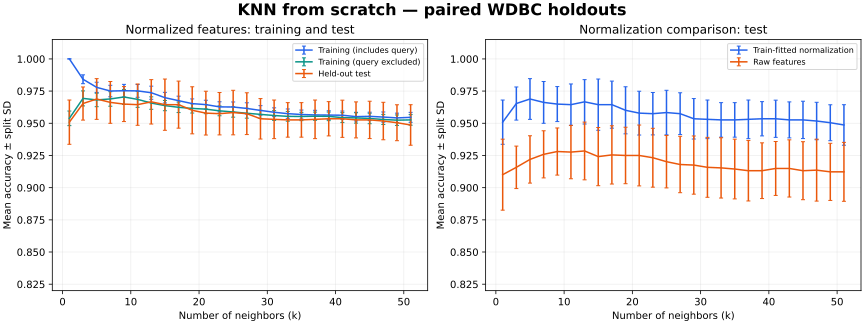
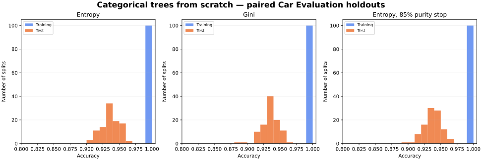

# KNN and Decision Trees From Scratch

NumPy implementations of Euclidean K-nearest neighbors and categorical decision
trees, developed from my COMPSCI 589 machine-learning coursework at UMass Amherst.
This portfolio version preserves the original source and adds corrected
preprocessing, reproducible experiments and recorded benchmark results.

**Python · NumPy · KNN · Entropy · Gini · Model evaluation**

- KNN with uniform voting, training-fitted min-max scaling, deterministic ties,
  and explicit exclusion of the query's training row.
- Multiway categorical trees with entropy/Gini splitting, majority fallback for
  unseen categories, and optional purity/depth stopping rules.
- Paired normalization/splitting-criterion comparisons, inner-validation k
  selection, per-run measurements, plots and automated checks.

Both classifiers and impurity calculations are implemented here. Scikit-learn
provides dataset loading and data splitting; its estimators and scalers are not
used.

## Run

Use Python 3.12 from this project directory:

```bash
python -m venv .venv
# macOS/Linux
source .venv/bin/activate
# Windows PowerShell: .venv\Scripts\Activate.ps1
python -m pip install -r requirements.txt
python -m unittest discover -s tests -v
python experiments.py all --knn-repeats 20 --tree-repeats 100 --seed 42 --output runs/benchmarks
```

The default datasets are available locally after installing the dependencies:
bundled scikit-learn WDBC and the checked-in UCI Car Evaluation files. The
experiment command performs no dataset download. See [dataset sources and
formats](data/README.md) for attribution and optional course CSVs.

For a quick check or one experiment:

```bash
python experiments.py all --knn-repeats 2 --tree-repeats 2 --output runs/quick
python knn.py --knn-repeats 20 --output runs/knn
python decision.py --tree-repeats 100 --output runs/trees
# Optional original course-format data:
python experiments.py all --wdbc datasets/wdbc.csv --car datasets/car.csv
```

## Verified results

Fresh runs of the maintained implementation, seed 42 onward. Accuracy values
below are percentages; ± values are standard deviations across splits.

| KNN, WDBC (20 paired outer splits) | Test accuracy after validation selects k |
|---|---:|
| Training-fitted min-max normalization | **96.45% ± 1.74 percentage points** |
| Raw features | 92.68% ± 1.99 percentage points |

Each outer split has 455 training rows and 114 test rows. The inner split uses
364 outer-training rows for fitting and 91 for validation. It selects k from
1, 3, …, 51 (smallest k wins ties), then refits on all outer-training rows before
test evaluation. Normalized/raw variants share every split.



The curves show an exploratory sweep of all k values. They are not used to
choose k for the results table. Ordinary training accuracy includes the query
as its own neighbor, making k=1 accuracy optimistic. The query-excluded curve
removes only that row, retaining genuine duplicate neighbors; it uses the same
training-fitted scaler and is a diagnostic rather than a separate validation
estimate.

| Tree, Car Evaluation (100 paired splits) | Training accuracy | Test accuracy | Mean nodes |
|---|---:|---:|---:|
| Entropy | 100.00% | 93.64% ± 1.38 pp | 342.30 |
| Gini | 100.00% | 93.47% ± 1.36 pp | 342.76 |
| Entropy with 85% purity stopping | 99.44% | 93.77% ± 1.33 pp | 293.77 |

Each outer split has 1,382 training rows and 346 test rows. The majority-class
baseline achieves 69.94% test accuracy. Tree settings are fixed before these
runs; all three variants share each split. The purity rule yields smaller trees
with a small observed accuracy difference; these measurements do not establish
that one splitting/stopping rule is consistently superior.



Repeated holdout test sets overlap. Split standard deviations describe
variation in these experiments, not confidence intervals. These histograms
combine model changes and test-sample changes; they do not isolate tree
instability under a controlled perturbation.

[Full metrics](results/benchmarks/metrics.json) ·
[KNN runs](results/benchmarks/knn_runs.csv) ·
[Validation-selected k values](results/benchmarks/knn_selection.csv) ·
[Tree runs](results/benchmarks/tree_runs.csv) ·
[Dataset and split fingerprints](results/benchmarks/provenance.json)

The recorded runs used Python 3.12.14, NumPy 2.3.5 and scikit-learn 1.8.0, with
`OPENBLAS_NUM_THREADS=1` and `OMP_NUM_THREADS=1`. Install
`requirements-reproduce.txt` for that dependency set. Dataset fingerprints and
per-partition index hashes accompany the records.

## Use the implementations

```python
from knn import KNNClassifier
from decision import CategoricalDecisionTree

knn = KNNClassifier(normalize=True).fit(X_train_numeric, y_train)
predictions = knn.predict(X_test_numeric, k=3)

tree = CategoricalDecisionTree(criterion="entropy").fit(X_train_categorical, y_train)
predictions = tree.predict(X_test_categorical)
print(tree.statistics())
```

KNN supports numeric or string class labels; distance ties retain training-row
order, and vote ties select the smallest sorted class. Tree inputs/labels are
categorical strings; class ties use sorted order and split ties use feature
index order. An unseen value returns the majority at the node where traversal
stops. Zero-gain splits are allowed so interactions such as XOR remain learnable.

## Recreate the plots

```bash
python -m pip install -r requirements-plots.txt
python plot_results.py --results results/benchmarks --output results/figures
# To plot a new experiment instead:
python plot_results.py --results runs/benchmarks --output runs/figures
```

Plotting uses recorded CSVs and does not rerun training. `--png` adds local PNG
previews alongside the SVGs.

## Original coursework and maintenance

[`archive/`](archive/) contains exact copies of the supplied code and TeX file.
The TeX file is an **unfilled assignment template**, not a completed report; its
example figure PDFs were not attached. The course CSVs and original result
plots were also absent, so the checked-in results are newly generated public
benchmark experiments.

The main corrections are reuse of training scaling on test data, constant
feature handling, actual majority labels at terminal branches, unseen-category
fallback and paired seeded comparisons. The formerly unfinished 85% purity
variant was added during portfolio maintenance. Details and source hashes are
in [provenance](docs/provenance.md).

All 15 automated checks passed locally. GitHub Actions runs the checks and a
short end-to-end experiment on both datasets.
