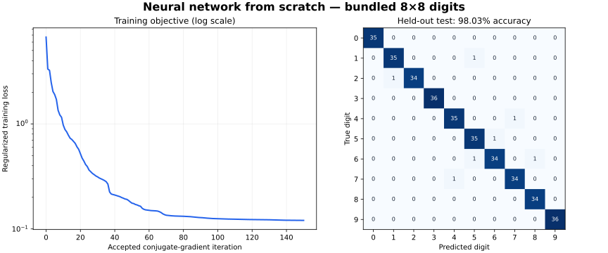

# Neural Network From Scratch

A handwritten-digit classifier built with explicit NumPy forward propagation
and backpropagation, adapted from my machine-learning coursework. The original
submission targets MNIST; this maintained version also provides a quick,
reproducible demo on scikit-learn's bundled 8×8 digits.

**Python · NumPy · Backpropagation · Cross entropy · L2 regularization · SciPy**

- Implements a single hidden layer, sigmoid activations, analytic gradients and
  a non-bias L2 penalty; SciPy conjugate gradient performs the optimization.
- Fits constant-feature removal on training data, normalizes pixels and saves
  preprocessing with the model for consistent inference.
- Includes numerical gradient checks, recorded real-data results and an
  unchanged archive of the coursework script.

## Run the demo

Use Python 3.12 from this project directory:

```bash
python -m venv .venv
# macOS/Linux
source .venv/bin/activate
# Windows PowerShell: .venv\Scripts\Activate.ps1
python -m pip install -r requirements-demo.txt
python train.py --dataset digits --hidden 32 --regularization 0.1 --maxiter 150 --seed 42 --output runs/digits-demo
python -m unittest discover -s tests -v
```

The command writes `model.npz`, `metrics.json`, `dataset.json`, `loss.csv`,
`test_predictions.csv` and `confusion.csv`. Training uses NumPy and SciPy;
scikit-learn loads the demo dataset. No dataset download occurs during this run.

## Verified demo results

One recorded run with fixed parameters and seed 42:

| Partition | Samples | Correct | Accuracy |
|---|---:|---:|---:|
| Training | 1,087 | 1,087 | 100.00% |
| Validation | 355 | 346 | 97.46% |
| Held-out test | 355 | 348 | **98.03%** |



The network has 32 hidden units and 10 outputs; 60 of the 64 raw features are
retained. Per-class splits approximate 60/20/20, rounding validation/test counts
down. Feature selection uses training samples only. Hyperparameters were fixed
before this run; validation and test data do not enter optimization.

The loss decreased from **6.7040 to 0.1206**. Conjugate gradient completed its
**150-iteration budget** and reported `success=false` with the maximum-iteration
status; these metrics do not imply optimizer convergence. This is a single
split/run, not a cross-validation study. Training accuracy exceeding held-out
accuracy also leaves a generalization gap.

These are **bundled 8×8 digits results**. The ZIP did not contain the MNIST
dataset, so no original or full-MNIST accuracy is claimed here. See
[recorded metrics](results/digits-demo/metrics.json),
[test predictions](results/digits-demo/test_predictions.csv) and
[split provenance](results/digits-demo/dataset.json).

The recorded run used Python 3.12.14, NumPy 2.3.5, SciPy 1.17.0 and scikit-learn
1.8.0, with `OPENBLAS_NUM_THREADS=1` and `OMP_NUM_THREADS=1`. For that dependency
set, install `requirements-reproduce.txt` instead of `requirements-demo.txt`.
Numerical libraries and threading can affect iterative optimization results.

## Run with the original MNIST format

Place your own `mnist_all.mat` in `data/` (see [dataset setup](data/README.md)):

```bash
python -m pip install -r requirements.txt
python train.py --dataset mnist --data data/mnist_all.mat --hidden 200 --regularization 0 --maxiter 50 --seed 42 --output runs/mnist
```

This uses the original hidden-layer size, regularization value and iteration
budget with corrected normalization and math. Full-batch optimization on MNIST
requires substantially more memory/time than the demo. The loader reserves
1,000 randomized training examples per digit for validation and preserves the
supplied test partition. The dataset and generated checkpoints are gitignored.

## Load a trained model

```python
from nnScript import Model

model = Model.load("runs/digits-demo/model.npz")
# raw_images: finite N×64 matrix of 8×8 pixels flattened in row-major order,
# using the same 0..16 scale as the demo; MNIST models expect their own format.
predictions = model.predict(raw_images)
```

The model stores weights, feature mask and pixel scale. The output units are
independent sigmoid classifiers; their scores are not normalized multiclass
probabilities. Prediction selects the largest output logit.

## Recreate the figure

```bash
python -m pip install -r requirements-plots.txt
python plot_results.py --results results/digits-demo --output results/digits-demo.svg
```

The figure reads the checked-in loss and confusion counts and does not retrain.

## Source and checks

[`archive/nnScript_original.py`](archive/nnScript_original.py) preserves the
supplied coursework script. The maintained implementation fixes missing input
normalization, unstable logarithms and missing L2 gradient terms, and adds
deterministic splits, saved preprocessing and reproducible commands.
The archived checkpoint/video are not published or used to produce these
results. See [source history and verification scope](docs/provenance.md).

The 12 automated tests include finite-difference gradient checks with and
without regularization, exclusion of biases from the L2 penalty, finite losses
at extreme logits, learned predictions, saved-model inference and dataset
partition checks. GitHub Actions runs these checks and a short training demo.
